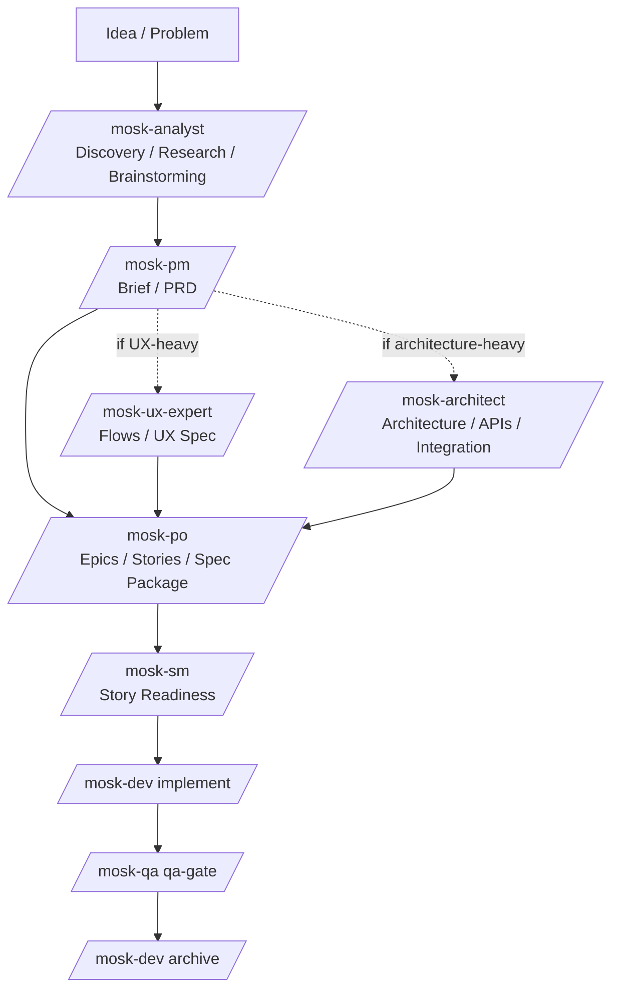
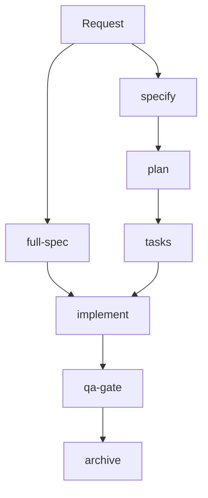

# MOSK

MOSK is a Spec-Driven Development toolkit for Claude Code.

It is inspired by two ideas:

- **BMAD**: specialist agents with explicit roles
- **SpecKit**: a structured path from problem framing to executable work

MOSK is not a branded repackaging of either one. It is a lighter synthesis built for:

- direct natural-language activation
- lower token overhead
- a short default path
- fewer mandatory menus and rituals
- installability inside real projects through `.claude/`

## Core Idea

Every meaningful change should become explicit work:

1. clarify the change
2. shape the specification
3. create the implementation plan
4. generate ordered tasks
5. implement
6. review quality
7. archive the result

## Philosophy

MOSK keeps the parts that were useful in BMAD and SpecKit:

- role clarity
- structured artifacts
- explicit handoffs
- incremental delivery

MOSK intentionally removes or downplays the parts that add friction:

- heavy activation prompts
- mandatory multi-step menus
- bloated orchestration layers
- optional workflow packs in the default install
- legacy bundle branding inside the shipped toolkit

## Flows

### From Zero

Use this when the work starts as a vague idea and still needs discovery, product framing, architecture, and story shaping.



This is the longer product path. Use only the agents that materially help the change.

### Daily Flow

Use this when the request is already clear enough to move straight into the spec package.



Daily defaults:

- compact path: `full-spec -> implement -> qa-gate -> archive`
- granular path: `specify -> plan -> tasks -> implement -> qa-gate -> archive`
- optional helpers: `clarify`, `analyze`, `checklist`

`full-spec` stops at `tasks`. Implementation remains separate with `mosk-dev`.

## Fast Path

Use the agents directly with natural language:

```
/mosk-po full-spec checkout com cupom
```

```
/mosk-dev implementar a spec 012
```

```
/mosk-qa revisar a spec 012
```

Default happy path:

```
/mosk-po full-spec
```
```
/mosk-dev implement
```
```
/mosk-qa qa-gate
```
```
/mosk-dev archive
```

## Skills vs Agents

MOSK agents can be invoked in two ways inside Claude Code:

### Skill (slash command)

Runs **inside the current conversation**, sharing the full chat context. This is the default and recommended way.

```
/mosk-dev implement a spec 012
```

### Agent (subagent)

Runs as a **separate process** with its own context. Does not see the current conversation history. Useful for parallel or isolated work. Claude Code spawns agents internally when needed.

| | Skill | Agent |
|---|---|---|
| Shares conversation context | yes | no |
| Parallel execution | no | yes |
| Interactive with the user | yes | no |
| Isolates heavy output | no | yes |

**For daily use, prefer skills (slash commands).**

## Agents

| Skill | Responsibility |
|---|---|
| `/mosk-analyst` | discovery, research, brainstorming |
| `/mosk-pm` | PRD, product scope, success criteria |
| `/mosk-ux-expert` | user flows, UX specs, front-end behavior |
| `/mosk-architect` | architecture, APIs, integrations |
| `/mosk-po` | specs, planning, task generation |
| `/mosk-sm` | readiness, sequencing, story hygiene |
| `/mosk-dev` | implementation, fixes, archive |
| `/mosk-qa` | quality gates, test strategy, review |
| `/mosk-orchestrator` | routing when the right next step is unclear |
| `/mosk-master` | mixed one-off work |

## Spec Types

The same pipeline supports:

- `feature`
- `fix`
- `hotfix`
- `gmud`
- `refactor`
- `experimental`

Folder and branch pattern:

```text
{###}-{type}-{short-name}
```

Example:

```text
012-feature-checkout-coupon
```

## Installation

Install MOSK into the current project:

```bash
npx degit rogerznts/mosk/mosk .
```

Force (overwrite existing files):

```bash
npx degit rogerznts/mosk/mosk . --force
```

One-command install for Codex users:

```bash
npx degit rogerznts/mosk/mosk . && bash .claude/mosk/scripts/link-codex-skills.sh
```

Force overwrite and recreate existing symlinks:

```bash
npx degit rogerznts/mosk/mosk . --force && bash .claude/mosk/scripts/link-codex-skills.sh --force
```

Restart Claude Code after install so the new skills are loaded.

If you also use Codex, create symlinks from the installed `.claude/skills/` into the project's `.codex/skills/` directory:

```bash
bash .claude/mosk/scripts/link-codex-skills.sh
```

Force recreation of existing symlinks:

```bash
bash .claude/mosk/scripts/link-codex-skills.sh --force
```

This step is optional. `degit` only copies files; it does not run post-install scripts automatically.

## Installed Structure

```text
your-project/
├── .claude/
│   ├── mosk/
│   │   ├── agents/
│   │   ├── tasks/
│   │   ├── templates/
│   │   ├── scripts/
│   │   ├── core-config.yaml
│   │   └── constitution.md
│   └── skills/
│       ├── mosk-analyst/
│       ├── mosk-architect/
│       ├── mosk-boot/
│       ├── mosk-dev/
│       ├── mosk-help/
│       ├── mosk-master/
│       ├── mosk-orchestrator/
│       ├── mosk-pm/
│       ├── mosk-po/
│       ├── mosk-qa/
│       ├── mosk-sm/
│       └── mosk-ux-expert/
└── docs/
    └── specs/
```

## Commands

The preferred command style is natural language via slash commands.

### SpecKit (mosk-po)

```
/mosk-po full-spec login social para clientes B2B
```

```
/mosk-po specify login social para clientes B2B
```

```
/mosk-po plan a spec atual
```

```
/mosk-po tasks para a spec atual
```

### Implementation (mosk-dev)

```
/mosk-dev implement a spec 012
```

```
/mosk-dev archive a spec 012
```

### Quality (mosk-qa)

```
/mosk-qa qa-gate a spec 012
```

### Command Intent

| Command | What it does |
|---|---|
| `full-spec` | runs `specify -> plan -> tasks` in one pass |
| `specify` | creates or updates only `spec.md` |
| `plan` | creates or updates only `plan.md` |
| `tasks` | creates or updates only `tasks.md` |
| `implement` | stays with `mosk-dev` |
| `qa-gate` | stays with `mosk-qa` |
| `archive` | stays with `mosk-dev` |

Advanced star-prefixed commands can still exist as compatibility shortcuts, but they are no longer the primary UX.

## Bootstrapping Existing Projects

For an existing repository, run:

```text
/mosk-boot
```

The boot workflow generates a compact context pack by default:

- `ctx-project`
- `ctx-frontend` only when frontend code exists

## What Changed From The Legacy Bundle

The current MOSK template already removes a large amount of optional legacy structure:

- redundant agent wrappers
- team bundles in the default install
- workflow YAML packs
- KB mode and legacy knowledge-base routing
- legacy guidance packs outside the core path

The remaining files may still show traces of the original inspiration in comments or template lineage, but the shipped product is now positioned and maintained as MOSK.

## Inspiration

MOSK owes a real conceptual debt to:

- BMAD, for role-driven collaboration
- SpecKit, for turning vague requests into explicit artifacts

The goal is to preserve those strengths while making the toolkit smaller, sharper, and cheaper to run.

## Optional Environment Tools

MOSK itself runs inside Claude Code. If you want extra operational isolation, these still pair well with it:

- `workz` for isolated worktrees
- `ai-jail` for filesystem confinement
