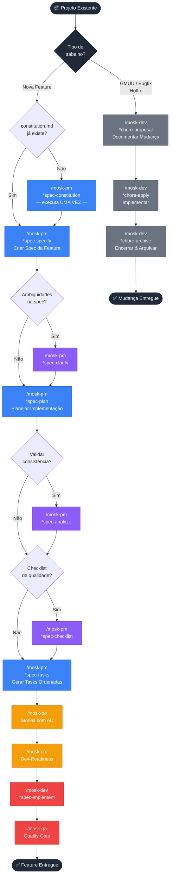

# MOSK Toolkit

**Mad Open Spec Kit** — Toolkit de Spec-Driven Development (SDD) instalável em qualquer projeto via `npx degit`.

---

## Origem

Este toolkit nasceu da minha experiência pessoal orquestrando agentes do BMAD Core adaptados e integrados ao SpecKit. Na prática, percebi ganhos expressivos ao separar claramente dois conjuntos de responsabilidades: agentes especializados para raciocínio, discovery e documentação estratégica — e o SpecKit para especificação estruturada e implementação de features.

O Chore Mode foi inspirado no fluxo do Open Spec — não no seu conteúdo, mas na ideia de usar planejamento estruturado diretamente nas ferramentas de IA, como o Claude Code, para registrar, executar e arquivar mudanças operacionais (GMUDs, bugfixes, hotfixes) de forma rastreável e sem burocracia.

---

## O que é o MOSK

O MOSK combina três camadas em um único toolkit coeso:

- **BMAD Core** — 10 agentes especializados para discovery, arquitetura, produto e qualidade
- **SpecKit** — Pipeline de especificação-para-implementação gerenciado pelo PM, executado pelo Dev
- **Chore Mode** — Fluxo leve para mudanças rápidas, bugfixes e GMUDs (Dev-owned)

Tudo funciona através de skills do Claude Code (slash commands) sem dependência de CLI externa.

---

## Instalação

```bash
# Instalar na raiz do projeto atual
npx degit rogerznts/mosk/mosk .

# Forçar (sobrescrever arquivos existentes)
npx degit rogerznts/mosk/mosk . --force
```

Após instalar, reinicie o Claude Code. As skills aparecem automaticamente como slash commands.

---

## Estrutura Instalada

```
seu-projeto/
├── .claude/
│   ├── mosk/                  # Core MOSK (agentes, tasks, templates)
│   │   ├── agents/            # Definições dos 10 agentes
│   │   ├── tasks/             # Workflows executáveis
│   │   ├── templates/         # Templates de documentos
│   │   ├── scripts/           # Scripts de suporte
│   │   ├── constitution.md    # Princípios do projeto (criado pelo PM)
│   │   └── core-config.yaml   # Configuração central
│   └── skills/                # Delegações de skill (slash commands)
│       ├── mosk-analyst/
│       ├── mosk-architect/
│       ├── mosk-dev/
│       ├── mosk-master/
│       ├── mosk-orchestrator/
│       ├── mosk-pm/
│       ├── mosk-po/
│       ├── mosk-qa/
│       ├── mosk-sm/
│       └── mosk-ux-expert/
└── docs/                      # Criado pelos workflows
    ├── specs/                 # Especificações de features (SpecKit)
    │   └── 001-nome-feature/
    │       ├── spec.md
    │       ├── plan.md
    │       ├── tasks.md
    │       ├── data-model.md  # (opcional)
    │       ├── research.md    # (opcional)
    │       └── contracts/     # (opcional)
    └── changes/               # Mudanças rápidas (Chore Mode)
        └── [change-id]/
            ├── proposal.md
            └── tasks.md
```

---

## Os 10 Agentes

| Skill | Agente | Role |
|---|---|---|
| `/mosk-analyst` | Maria | Pesquisa de mercado, brainstorming, project brief, análise competitiva |
| `/mosk-architect` | Vinicius | Arquitetura de sistemas, stack, APIs, infraestrutura |
| `/mosk-pm` | João | PRDs, estratégia de produto, feature specs (SpecKit) |
| `/mosk-po` | Sara | Backlog, stories com AC, critérios de aceitação |
| `/mosk-sm` | Roberto | Dev-readiness de stories, notas técnicas, agilidade |
| `/mosk-dev` | Jaime | Implementação, debugging, refatoração, Chore Mode |
| `/mosk-qa` | Joaquim | Arquitetura de testes, quality gates, NFR, revisões |
| `/mosk-ux-expert` | Salete | UI/UX, wireframes, front-end specs, prompts para geração de UI |
| `/mosk-master` | Mestre | Executor universal — expertise em todos os domínios |
| `/mosk-orchestrator` | Maestro | Coordenação de agentes, orientação de workflow |

---

## Fluxos de Trabalho

### Greenfield — Novo Projeto

Para projetos que partem do zero: discovery completo, definição de arquitetura e geração do PRD antes de qualquer feature.

```mermaid
flowchart TD
    Start(["🚀 Novo Projeto"]) --> A1["/mosk-analyst
    Project Brief & Pesquisa"]
    A1 --> A2["/mosk-architect
    Arquitetura & Stack"]
    A2 --> A3["/mosk-pm
    PRD & Épicos"]
    A3 --> C["/mosk-pm
    *spec-constitution
    — executa UMA VEZ —"]

    C --> S["/mosk-pm
    *spec-specify
    Criar Spec da Feature"]
    S --> CQ{"Ambiguidades
    na spec?"}
    CQ -->|Sim| CL["/mosk-pm
    *spec-clarify
    Resolver Ambiguidades"]
    CQ -->|Não| P
    CL --> P["/mosk-pm
    *spec-plan
    Planejar Implementação"]
    P --> AQ{"Validar
    consistência?"}
    AQ -->|Sim| AN["/mosk-pm
    *spec-analyze
    Análise Cross-Artifact"]
    AQ -->|Não| CHQ
    AN --> CHQ{"Checklist
    de qualidade?"}
    CHQ -->|Sim| CH["/mosk-pm
    *spec-checklist
    Checklist por Domínio"]
    CHQ -->|Não| T
    CH --> T["/mosk-pm
    *spec-tasks
    Gerar Tasks Ordenadas"]

    T --> PO["/mosk-po
    Stories com AC"]
    PO --> SM["/mosk-sm
    Dev-Readiness"]
    SM --> DQ{"Abordagem
    de implementação?"}
    DQ -->|"Feature completa
    (SpecKit)"| DI["/mosk-dev
    *spec-implement"]
    DQ -->|"Story por story
    (BMAD)"| DS["/mosk-dev
    *develop-story"]
    DI --> QA["/mosk-qa
    Quality Gate"]
    DS --> QA
    QA --> Done(["✅ Feature Completa"])
    QA -->|Issues encontradas| SM

    classDef discovery fill:#10b981,stroke:#059669,color:#fff
    classDef speckit fill:#3b82f6,stroke:#2563eb,color:#fff
    classDef optional fill:#8b5cf6,stroke:#7c3aed,color:#fff
    classDef stories fill:#f59e0b,stroke:#d97706,color:#fff
    classDef impl fill:#ef4444,stroke:#dc2626,color:#fff
    classDef endpoint fill:#1f2937,stroke:#111827,color:#fff

    class A1,A2,A3 discovery
    class C,S,P,T speckit
    class CL,AN,CH optional
    class PO,SM stories
    class DI,DS,QA impl
    class Start,Done endpoint
```



---

### Brownfield — Projeto Existente

Para projetos em andamento, o fluxo bifurca conforme o tipo de trabalho: nova feature (SpecKit) ou mudança rápida (Chore Mode).



> **Legenda de cores:**
> 🟢 Discovery (analyst, architect, pm)  🔵 SpecKit obrigatório  🟣 SpecKit opcional  🟡 Story preparation  🔴 Implementação & QA  ⚫ Chore Mode

---

## Referência Rápida de Skills

### Agentes

| Comando | Quando usar |
|---|---|
| `/mosk-orchestrator` | Não sabe qual agente usar; precisa coordenar workflow |
| `/mosk-master` | Tarefa pontual sem persona específica; expertise geral |
| `/mosk-analyst` | Discovery inicial, brief, pesquisa |
| `/mosk-architect` | Arquitetura técnica, stack, decisões estruturais |
| `/mosk-pm` | PRD, estratégia, feature specs (SpecKit completo) |
| `/mosk-po` | Backlog, épicos, stories com AC |
| `/mosk-sm` | Refinar stories para dev; garantir clareza para implementação |
| `/mosk-dev` | Implementar stories, spec-implement, Chore Mode |
| `/mosk-qa` | Revisão de qualidade, testes, NFR, quality gates |
| `/mosk-ux-expert` | UI/UX, wireframes, specs de front-end |

### SpecKit

| Comando | Dono | O que faz |
|---|---|---|
| `*spec-constitution` | PM — uma vez | Deriva princípios do projeto a partir de PRD + arquitetura |
| `*spec-specify` | PM | Cria `spec.md` a partir de descrição em linguagem natural |
| `*spec-clarify` | PM — opcional | Resolve ambiguidades com até 5 perguntas direcionadas |
| `*spec-plan` | PM | Gera artefatos de design (`data-model`, `contracts`, `research`) |
| `*spec-analyze` | PM — opcional | Valida consistência cross-artifact (não-destrutivo) |
| `*spec-checklist` | PM — opcional | Gera checklist de qualidade por domínio (ux, api, security…) |
| `*spec-tasks` | PM | Gera `tasks.md` ordenado e acionável |
| `*spec-implement` | Dev | Executa todas as tarefas do `tasks.md` |

### Chore Mode

| Comando | O que faz |
|---|---|
| `*chore-proposal {id}` | Cria `proposal.md` + `tasks.md` em `docs/changes/{id}/` |
| `*chore-apply {id}` | Implementa a mudança aprovada |
| `*chore-archive {id}` | Encerra e arquiva a mudança |

---

## Sobre Este Repositório

Este repositório é o **master template** do MOSK. Não é uma aplicação compilada — é uma coleção de Markdown, YAML e Bash que é instalada em projetos via `npx degit`.

Não há build, testes ou linter. A validação acontece via execução das skills nos projetos que usam o MOSK.

Para contribuir ou manter o toolkit, edite os arquivos em `mosk/` e teste instalando em um projeto de exemplo.
