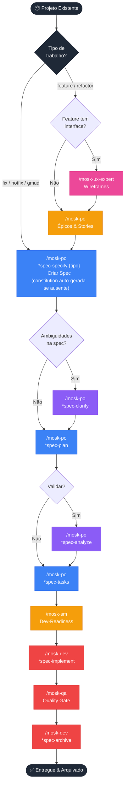

# MOSK Toolkit

**Mad Open Spec Kit** — Toolkit de Spec-Driven Development (SDD) instalável em qualquer projeto via `npx degit`.

---

## Origem

Este toolkit nasceu da minha experiência pessoal orquestrando agentes do BMAD Core adaptados e integrados ao SpecKit. Na prática, percebi ganhos expressivos ao separar claramente dois conjuntos de responsabilidades: agentes especializados para raciocínio, discovery e documentação estratégica — e o SpecKit para especificação estruturada e implementação de features.

A ideia central é que todo tipo de mudança — features, bugs, GMUDs, hotfixes ou refatorações — passa pelo mesmo pipeline de especificação estruturada, com o tipo refletido no nome da branch e da pasta (`{###}-{tipo}-{nome}`). Specs concluídas são arquivadas em `docs/specs/archive/`, mantendo histórico rastreável sem burocracia.

---

## O que é o MOSK

O MOSK combina duas camadas em um único toolkit coeso:

- **BMAD Core** — 10 agentes especializados para discovery, arquitetura, produto e qualidade
- **SpecKit** — Pipeline de especificação-para-implementação para todo tipo de mudança: features, fixes, hotfixes, GMUDs e refatorações

Tudo funciona através de skills do Claude Code (slash commands) sem dependência de CLI externa.

---

## Instalação

```bash
# Instalar na raiz do projeto atual
npx degit rogerznts/mosk/mosk .

# Forçar (sobrescrever arquivos existentes)
npx degit rogerznts/mosk/mosk . --force
```

Após instalar, reinicie o Claude Code. As skills aparecem automaticamente como slash commands.

---

## Ambiente Recomendado

O MOSK foi projetado para funcionar com o **Claude Code**, mas a experiência é potencializada com duas ferramentas complementares:

### Claude Code

O motor que executa o MOSK. Todas as skills (`/mosk-*`) são slash commands do Claude Code — sem ele, nada funciona.

Instalação: https://claude.ai/code

### workz — Gerenciador de Worktrees

https://github.com/rohansx/workz

O `workz` facilita o gerenciamento de git worktrees, permitindo trabalhar em múltiplas features em paralelo sem conflito de branches. No contexto do MOSK, onde cada spec vira uma branch `{###}-{tipo}-{nome}`, o `workz` permite alternar entre specs em andamento de forma ágil — cada uma em seu próprio diretório isolado.

**Quando usar:** sempre que você tiver múltiplas specs ou features em andamento simultaneamente.

### ai-jail — Sandbox de Filesystem para IA

https://github.com/akitaonrails/ai-jail

O `ai-jail` restringe o acesso do Claude Code ao filesystem, confinando-o apenas ao diretório do projeto atual. Evita que o agente navegue ou modifique arquivos fora do escopo pretendido — essencial em ambientes de produção ou ao trabalhar com múltiplos projetos no mesmo sistema.

**Quando usar:** sempre que quiser garantir que o Claude Code só acesse os arquivos do projeto corrente.

### Combinando as três ferramentas

```
workz → cria worktree para a spec (branch isolada)
  └── ai-jail → confina o Claude Code ao diretório da worktree
        └── Claude Code + MOSK → executa o pipeline SpecKit com segurança e isolamento
```

1. Use `workz` para criar uma worktree para a spec em andamento
2. Abra o Claude Code dentro da worktree via `ai-jail`
3. Execute o pipeline MOSK normalmente — confinado e isolado por projeto

---

## Estrutura Instalada

```
seu-projeto/
├── .claude/
│   ├── mosk/                  # Core MOSK (agentes, tasks, templates)
│   │   ├── agents/            # Definições dos 10 agentes
│   │   ├── tasks/             # Workflows executáveis
│   │   ├── templates/         # Templates de documentos
│   │   ├── scripts/           # Scripts de suporte
│   │   ├── constitution.md    # Princípios do projeto (criado automaticamente pelo PO no primeiro *spec-specify)
│   │   └── core-config.yaml   # Configuração central
│   └── skills/                # Delegações de skill (slash commands)
│       ├── mosk-analyst/
│       ├── mosk-architect/
│       ├── mosk-dev/
│       ├── mosk-master/
│       ├── mosk-orchestrator/
│       ├── mosk-pm/
│       ├── mosk-po/
│       ├── mosk-qa/
│       ├── mosk-sm/
│       ├── mosk-ux-expert/
│       ├── mosk-help/
│       └── mosk-boot/
└── docs/                      # Criado pelos workflows
    └── specs/                 # Todas as specs (features, fixes, GMUDs…)
        ├── 008-feature-score-checklist/   # {###}-{tipo}-{nome}
        │   ├── spec.md
        │   ├── plan.md
        │   ├── tasks.md
        │   ├── data-model.md  # (opcional)
        │   ├── research.md    # (opcional)
        │   └── contracts/     # (opcional)
        └── archive/           # Specs concluídas e arquivadas
            └── 001-feature-user-auth/
```

---

## Os 10 Agentes

| Skill | Agente | Role |
|---|---|---|
| `/mosk-analyst` | Maria | Pesquisa de mercado, brainstorming, project brief, análise competitiva |
| `/mosk-architect` | Vinicius | Arquitetura de sistemas, stack, APIs, infraestrutura |
| `/mosk-pm` | João | PRDs e estratégia de produto |
| `/mosk-po` | Sara | Backlog, épicos, stories com AC, spec-constitution e SpecKit (spec-specify → spec-tasks) |
| `/mosk-sm` | Roberto | Dev-readiness de stories, notas técnicas, agilidade |
| `/mosk-dev` | Jaime | Implementação, debugging, refatoração, spec-archive |
| `/mosk-qa` | Joaquim | Arquitetura de testes, quality gates, NFR, revisões |
| `/mosk-ux-expert` | Salete | User flows, wireframes, front-end specs, prompts para geração de UI |
| `/mosk-master` | Mestre | Executor universal — expertise em todos os domínios |
| `/mosk-orchestrator` | Maestro | Coordenação de agentes, orientação de workflow |

---

## Fluxos de Trabalho

### Greenfield — Novo Projeto

Para projetos que partem do zero: discovery completo, definição de arquitetura e geração do PRD antes de qualquer feature.

```mermaid
flowchart TD
    Start(["🚀 Novo Projeto"]) --> A1["/mosk-analyst
    Project Brief & Pesquisa"]
    A1 --> UX["/mosk-ux-expert
    Flows & Wireframes"]
    UX --> A3["/mosk-pm
    PRD"]
    A3 --> A2["/mosk-architect
    Arquitetura & Stack"]

    A2 --> PO["/mosk-po
    Épicos & Stories"]
    PO --> S["/mosk-po
    *spec-specify
    Criar Spec da Feature
    (constitution gerada automaticamente)"]
    S --> CQ{"Ambiguidades
    na spec?"}
    CQ -->|Sim| CL["/mosk-po
    *spec-clarify
    Resolver Ambiguidades"]
    CQ -->|Não| P
    CL --> P["/mosk-po
    *spec-plan
    Planejar Implementação"]
    P --> AQ{"Validar
    consistência?"}
    AQ -->|Sim| AN["/mosk-po
    *spec-analyze
    Análise Cross-Artifact"]
    AQ -->|Não| CHQ
    AN --> CHQ{"Checklist
    de qualidade?"}
    CHQ -->|Sim| CH["/mosk-po
    *spec-checklist
    Checklist por Domínio"]
    CHQ -->|Não| T
    CH --> T["/mosk-po
    *spec-tasks
    Gerar Tasks Ordenadas"]

    T --> SM["/mosk-sm
    Dev-Readiness"]
    SM --> DQ{"Abordagem
    de implementação?"}
    DQ -->|"Feature completa
    (SpecKit)"| DI["/mosk-dev
    *spec-implement"]
    DQ -->|"Story por story
    (BMAD)"| DS["/mosk-dev
    *develop-story"]
    DI --> QA["/mosk-qa
    Quality Gate"]
    DS --> QA
    QA --> Done(["✅ Feature Completa"])
    QA -->|Issues encontradas| SM

    classDef discovery fill:#10b981,stroke:#059669,color:#fff
    classDef ux fill:#ec4899,stroke:#db2777,color:#fff
    classDef speckit fill:#3b82f6,stroke:#2563eb,color:#fff
    classDef optional fill:#8b5cf6,stroke:#7c3aed,color:#fff
    classDef stories fill:#f59e0b,stroke:#d97706,color:#fff
    classDef impl fill:#ef4444,stroke:#dc2626,color:#fff
    classDef endpoint fill:#1f2937,stroke:#111827,color:#fff

    class A1,A2,A3 discovery
    class UX ux
    class S,P,T speckit
    class CL,AN,CH optional
    class PO,SM stories
    class DI,DS,QA impl
    class Start,Done endpoint
```



---

### Brownfield — Projeto Existente

Para projetos em andamento, todo trabalho — features, fixes, hotfixes, GMUDs e refatorações — usa o mesmo pipeline SpecKit com o tipo adequado.

> **Primeiro uso em projeto existente?** Execute `/mosk-boot` antes de qualquer outra skill. Ele analisa o codebase e gera skills de contexto em `.claude/skills/ctx-*/` com stack, padrões, arquitetura e workflows — capacitando a IA para trabalhar com o projeto desde o início.



> **Legenda de cores:**
> 🩷 UX (ux-expert)  🔵 SpecKit obrigatório  🟣 SpecKit opcional  🟡 Story preparation  🔴 Implementação, QA & Archive

---

## Referência Rápida de Skills

### Bootstrap

| Comando | Quando usar |
|---|---|
| `/mosk-boot` | Primeira vez em um projeto existente — analisa o código e gera skills de contexto em `.claude/skills/ctx-*/` (stack, padrões, arquitetura, workflows) |

### Agentes

| Comando | Quando usar |
|---|---|
| `/mosk-help` | Exibir guia rápido do fluxo MOSK e quando usar cada agente |
| `/mosk-orchestrator` | Não sabe qual agente usar; precisa coordenar workflow |
| `/mosk-master` | Tarefa pontual sem persona específica; expertise geral |
| `/mosk-analyst` | Discovery inicial, brief, pesquisa |
| `/mosk-architect` | Arquitetura técnica, stack, decisões estruturais |
| `/mosk-pm` | PRD e estratégia de produto |
| `/mosk-po` | Backlog, épicos, stories com AC, spec-constitution e SpecKit completo (specify → tasks) |
| `/mosk-sm` | Refinar stories para dev; validar dev-readiness e clareza técnica |
| `/mosk-dev` | Implementar stories, `*spec-implement`, `*spec-archive` |
| `/mosk-qa` | Revisão de qualidade, testes, NFR, quality gates |
| `/mosk-ux-expert` | User flows, wireframes e specs visuais — após discovery, antes da arquitetura |

### SpecKit

| Comando | Dono | O que faz |
|---|---|---|
| `*spec-constitution` | PO — uma vez (auto-run pelo `*spec-specify`) | Deriva princípios do projeto a partir de PRD + arquitetura |
| `*spec-specify` | PO | Cria `spec.md` a partir de descrição em linguagem natural |
| `*spec-clarify` | PO — opcional | Resolve ambiguidades com até 5 perguntas direcionadas |
| `*spec-plan` | PO | Gera artefatos de design (`data-model`, `contracts`, `research`) |
| `*spec-analyze` | PO — opcional | Valida consistência cross-artifact (não-destrutivo) |
| `*spec-checklist` | PO — opcional | Gera checklist de qualidade por domínio (ux, api, security…) |
| `*spec-tasks` | PO | Gera `tasks.md` ordenado e acionável |
| `*spec-implement` | Dev | Executa todas as tarefas do `tasks.md` |
| `*spec-archive {id}` | Dev | Move spec concluída para `docs/specs/archive/` |

### Tipos de Spec

| Tipo | Quando usar |
|------|-------------|
| `feature` | Nova funcionalidade ou capacidade |
| `fix` | Correção de bug não urgente |
| `hotfix` | Correção urgente de produção / vulnerabilidade |
| `gmud` | Mudança gerenciada, rollout, procedimento de GMUD |
| `refactor` | Reestruturação sem nova funcionalidade |
| `experimental` | Exploração, PoC, spike |

Formato da branch e pasta: `{###}-{tipo}-{nome}` (ex: `008-feature-score-checklist`, `012-fix-payment-timeout`)

---

## Sobre Este Repositório

Este repositório é o **master template** do MOSK. Não é uma aplicação compilada — é uma coleção de Markdown, YAML e Bash que é instalada em projetos via `npx degit`.

Não há build, testes ou linter. A validação acontece via execução das skills nos projetos que usam o MOSK.

Para contribuir ou manter o toolkit, edite os arquivos em `mosk/` e teste instalando em um projeto de exemplo.
