# 🚀 MOSK Toolkit

**Mad Open Spec Kit** - Toolkit completo para Spec-Driven Development (SDD)

## 📋 Visão Geral

O MOSK é um toolkit unificado que integra três ferramentas complementares, cada uma projetada para um propósito específico no ciclo de desenvolvimento orientado a especificações. Através da metodologia SDD (Spec-Driven Development), o MOSK garante que todo o processo de desenvolvimento seja documentado, estruturado e rastreável desde a concepção até a entrega.

## 🔧 Componentes do Toolkit

### 1. **BMAD Core** - Discovery & Ideação

**Quando usar:** Fase inicial de discovery, brainstorming e documentação estratégica

**Propósitos:**
- 🔍 **Discovery inicial** de sistemas e projetos
- 📊 **Análise de novas features** e requisitos
- 🏗️ **Arquitetura** de funcionalidades e componentes
- 💡 **Brainstorming** e exploração de soluções
- 👤 **Análise de UX** e experiência do usuário
- 📝 **Geração de documentos** através de agentes especializados

O BMAD Core utiliza agentes inteligentes para produzir documentação de alto nível, como:
- PRDs (Product Requirements Documents)
- Epics e histórias de usuário
- Briefs técnicos e funcionais
- Análises de arquitetura
- Documentos de UX/UI

### 2. **SpecKit** - Implementação & Features

**Quando usar:** Criação e desenvolvimento de features baseadas em especificações

**Propósitos:**
- ✨ **Criação de Features** estruturadas com branches por feature
- 📋 **Implementação baseada em Briefs e PRDs** gerados pelo BMAD
- 🎯 **Desenvolvimento orientado por Epics**
- 🔄 **Rastreabilidade** entre especificação e implementação

O SpecKit transforma a documentação estratégica do BMAD em código mais objetivo, mantendo total alinhamento entre o que foi planejado e o que está sendo desenvolvido.

### 3. **Chore Mode (Plan Mode)** - Manutenção & Operações

**Quando usar:** Ações rápidas, correções e operações do dia a dia

**Propósitos:**
- 🔧 **GMUD** (Gestão de Mudanças)
- 🐛 **Bugfix** e correções
- 🔥 **Hotfix** emergenciais
- ⚡ **Ações rápidas** e pontuais
- 🗂️ **Registro leve** de propostas, tarefas e decisões

O Chore Mode usa o Plan Mode nativo do Cursor para mudanças rápidas com documentação enxuta e rastreável, sem dependência de CLI externa.

## 🔄 Fluxo de Trabalho SDD

```
1. 🔍 BMAD Core
   └─> Discovery & Análise
       └─> Geração de PRDs, Epics e Briefs
           
2. ✨ SpecKit
   └─> Implementação de Features
       └─> Criação de branches baseadas em especificações
           
3. 🔧 Chore Mode (Plan Mode)
   └─> Manutenção & Hotfixes
       └─> Correções e mudanças rápidas
```

## 🎯 Benefícios da Abordagem SDD

- **📚 Documentação viva** - Especificações sempre atualizadas
- **🔍 Rastreabilidade** - Do requisito ao código
- **🤝 Colaboração** - Linguagem comum entre times
- **⚡ Agilidade** - Ferramenta certa para cada momento
- **🎨 Qualidade** - Desenvolvimento baseado em especificações claras

## 📖 Como Usar

### 🎯 Sobre Este Repositório

Este repositório é dedicado à **manutenção e administração do MOSK Toolkit**. Ele deve ser gerenciado por alguém que compreende profundamente a metodologia SDD e a estrutura das ferramentas, pois com o tempo será necessário:

- Atualizar agentes e comandos conforme evoluem as necessidades
- Adicionar novos templates e workflows
- Manter a consistência entre as três ferramentas
- Documentar novas funcionalidades e casos de uso

### 📦 Instalação em Projetos

Para instalar o MOSK Toolkit em qualquer projeto (Greenfield ou Brownfield) utilize os comandos abaixo:

```bash
# Instalar no diretório atual
npx degit rogerznts/mosk/mosk .
```

```bash
# Instalar em um diretório específico
npx degit rogerznts/mosk/mosk ./meu-projeto
```

```bash
# Forçar instalação (sobrescrever arquivos)
npx degit rogerznts/mosk/mosk . --force
```

**Após instalação:**
1. Reinicie o Cursor IDE
2. Digite `/` para ver os 21 comandos disponíveis


Estrutura que será copiada:
```
seu-projeto/
├── .cursor/
│   └── commands/          # Slash commands personalizados
├── toolkit/
│   ├── .bmad-core/       # Agentes e recursos do BMAD
│   ├── .specify/         # Templates e scripts do SpecKit
│   └── changes/          # Mudanças rápidas (proposal/tasks/design)
└── docs/                 # Criado automaticamente ao usar SpecKit
    └── specs/            # Especificações de features
        └── 001-feature/  # Cada feature em seu diretório
            ├── spec.md
            ├── plan.md
            ├── tasks.md
            └── ...
```


Para instalar o MOSK Toolkit manualmente em qualquer projeto (Greenfield ou Brownfield), basta copiar o conteúdo abaixo para a raiz do seu projeto:

```bash
# Copie a pasta .cursor para a raiz do seu projeto
cp -r mosk/.cursor /caminho/do/seu/projeto/
```
```bash
# Copie a pasta toolkit para a raiz do seu projeto
cp -r mosk/toolkit /caminho/do/seu/projeto/
```

### 📁 Organização dos Documentos

O MOSK Toolkit mantém duas estruturas de documentação distintas:

#### 📋 SpecKit - Features (`/docs/specs/`)

Documentação de features criadas com o SpecKit, organizadas por branch:

```
docs/specs/
├── 001-user-authentication/
│   ├── spec.md          # Especificação da feature
│   ├── plan.md          # Plano de implementação
│   ├── research.md      # Pesquisas técnicas
│   ├── data-model.md    # Modelo de dados
│   ├── quickstart.md    # Guia rápido
│   ├── contracts/       # Contratos de API
│   └── tasks.md         # Lista de tarefas
├── 002-payment-system/
│   └── ...
└── 003-dashboard/
    └── ...
```

#### 🔧 Chore Mode - Mudanças (`/toolkit/changes/`)

Propostas de mudança para GMUDs, bugfixes e hotfixes com fluxo leve baseado em Plan Mode:

```
toolkit/changes/
├── [change-id]/
│   ├── proposal.md
│   ├── tasks.md
│   └── design.md       # Opcional
└── archive/            # Histórico manual opcional
```

**Quando usar cada uma:**
- **`/docs/specs/`** → Use para features completas criadas com `/mosk-spec-*` commands
- **`/toolkit/changes/`** → Use para mudanças pontuais com `/mosk-chore-*` commands e Plan Mode

### ⚡ Slash Commands

O MOSK Toolkit utiliza **slash commands customizados** para o Cursor IDE, facilitando o acesso rápido aos agentes e funcionalidades. Todos os comandos estão disponíveis digitando `/` no Cursor.

#### 🧙 BMAD Core - Agentes de Discovery

**`/mosk-ag-master`** - Executor universal de tarefas do BMAD. Use quando precisar de expertise em múltiplas áreas ou executar tarefas pontuais sem ativar uma persona específica. Ideal para criar documentos, executar checklists ou rodar workflows sem transformação de agente.

**`/mosk-ag-orchestrator`** - Orquestrador principal que coordena múltiplos agentes e workflows. Use quando não tiver certeza de qual especialista consultar ou quando precisar coordenar trabalho entre várias áreas. Ele guia você na escolha do agente certo para cada necessidade.

**`/mosk-ag-analyst`** - Analista de negócios especializado em pesquisa de mercado, brainstorming, análise competitiva e criação de project briefs. Use para discovery inicial, pesquisa estratégica e documentação de projetos existentes (brownfield).

**`/mosk-ag-architect`** - Arquiteto de sistemas para design técnico, seleção de tecnologia, design de APIs e planejamento de infraestrutura. Use quando precisar criar documentos de arquitetura (backend, frontend ou fullstack) ou tomar decisões técnicas estruturais.

**`/mosk-ag-dev`** - Desenvolvedor fullstack para implementação de código, debugging e refatoração. Use quando for implementar stories, aplicar correções de QA ou executar o desenvolvimento propriamente dito seguindo as especificações criadas.

**`/mosk-ag-po`** - Product Owner para gestão de backlog, refinamento de stories, critérios de aceitação e planejamento de sprints. Use para validar artefatos, criar epics e stories, ou garantir a integridade e consistência da documentação.

**`/mosk-ag-pm`** - Product Manager para criação de PRDs, estratégia de produto, priorização de features e planejamento de roadmap. Use quando precisar criar documentos de requisitos de produto (PRD) ou definir estratégia e visão de produto.

**`/mosk-ag-qa`** - Test Architect para revisão de arquitetura de testes, decisões de quality gates e avaliação abrangente de qualidade. Use para reviews completos de stories, avaliação de riscos, design de testes e validação de requisitos não-funcionais.

**`/mosk-ag-sm`** - Scrum Master para criação de stories, gestão de epics, retrospectivas e orientação em processos ágeis. Use quando precisar preparar stories detalhadas e acionáveis para desenvolvedores, garantindo clareza e handoffs precisos.

**`/mosk-ag-ux-expert`** - Expert em UX para design de UI/UX, wireframes, protótipos e especificações de front-end. Use quando precisar criar especificações visuais, otimizar experiência do usuário ou gerar prompts para ferramentas de geração de UI (como v0 ou Lovable).

#### 🎯 SpecKit - Desenvolvimento Orientado a Specs

**`/mosk-spec-constitution`** - Cria ou atualiza a constituição do projeto, definindo princípios e regras não-negociáveis que governam todo o desenvolvimento. Use no início do projeto ou quando precisar estabelecer/revisar os princípios fundamentais de qualidade e governança.

**`/mosk-spec-specify`** - Cria uma nova especificação de feature a partir de descrição em linguagem natural. Gera automaticamente uma branch, extrai requisitos, define critérios de sucesso e cria o documento spec.md completo. Use quando iniciar uma nova feature.

**`/mosk-spec-clarify`** - Identifica áreas ambíguas na especificação e faz até 5 perguntas direcionadas para reduzir incertezas. Atualiza automaticamente a spec.md com as respostas. Use após criar a spec para resolver ambiguidades antes do planejamento.

**`/mosk-spec-plan`** - Executa o workflow de planejamento de implementação, gerando artefatos de design (data-model.md, contracts/, research.md). Segue a estrutura do plan.md template para definir arquitetura técnica. Use após a especificação estar clara e validada.

**`/mosk-spec-tasks`** - Gera lista de tarefas ordenadas e acionáveis (tasks.md) baseada nos artefatos de design. Organiza por user story, identifica dependências e oportunidades de paralelização. Use após o planejamento estar completo.

**`/mosk-spec-checklist`** - Cria checklists customizados de qualidade para validar requisitos ("testes unitários para documentação"). Valida completude, clareza e consistência da especificação. Use quando precisar verificar qualidade dos requisitos em domínios específicos.

**`/mosk-spec-analyze`** - Realiza análise de consistência cross-artifacts entre spec.md, plan.md e tasks.md. Detecta duplicações, ambiguidades e gaps de cobertura. Use após gerar tasks para validar antes da implementação.

**`/mosk-spec-implement`** - Executa o plano de implementação processando todas as tarefas do tasks.md. Verifica checklists, segue dependências e reporta progresso. Use quando tudo estiver validado e pronto para implementar.

#### 🔧 Chore Mode - Mudanças Rápidas (Plan Mode)

**`/mosk-chore-proposal`** - Cria uma proposta de mudança rápida com scaffold completo (`proposal.md`, `tasks.md`, `design.md`) em `toolkit/changes/<change-id>/`. Use para GMUDs, bugfixes e ajustes pontuais.

**`/mosk-chore-apply`** - Implementa uma mudança aprovada, executando as tarefas definidas e mantendo sincronia com a proposta. Use após revisão e aprovação.

**`/mosk-chore-archive`** - Finaliza uma mudança concluída com encerramento manual (registro e histórico opcional), sem merge automático de specs.

## 🚀 Começando

1. **Instale o toolkit** copiando as pastas `.cursor` e `toolkit` para seu projeto
2. **Inicie com BMAD Core** (`/mosk-ag-orchestrator` ou agentes específicos) para discovery e gerar especificações
3. **Use SpecKit** (`/mosk-spec-specify` → `/mosk-spec-plan` → `/mosk-spec-implement`) para implementar features
4. **Aplique Chore Mode** (`/mosk-chore-proposal`) para manutenções rápidas e correções

## 📚 Recomendações de Uso

### 📊 Fluxograma de Uso

```mermaid
flowchart TD
    Start([Início do Projeto]) --> ProjectType{Tipo de Projeto?}
    
    %% Greenfield Flow
    ProjectType -->|Novo Projeto<br/>Greenfield| Analyst[/mosk-ag-analyst<br/>Project Brief/]
    Analyst --> Architect[/mosk-ag-architect<br/>Arquitetura & Stack/]
    Architect --> PO[/mosk-ag-po<br/>Épicos & Stories/]
    PO --> Constitution[/mosk-spec-constitution<br/>Memória & Padrões/]
    
    %% Brownfield Flow
    ProjectType -->|Projeto Existente<br/>Brownfield| WorkType{Tipo de Trabalho?}
    
    %% SpecKit Flow - New Features
    WorkType -->|Nova Feature| Constitution
    Constitution --> Specify[/mosk-spec-specify<br/>Especificação & Branch/]
    Specify --> ClarifyOpt{Precisa<br/>Clarificar?}
    ClarifyOpt -->|Sim| Clarify[/mosk-spec-clarify<br/>Resolver Ambiguidades/]
    ClarifyOpt -->|Não| Plan
    Clarify --> Plan[/mosk-spec-plan<br/>Planejamento Técnico/]
    Plan --> AnalyzeOpt{Validar<br/>Consistência?}
    AnalyzeOpt -->|Sim| Analyze[/mosk-spec-analyze<br/>Análise Cross-Artifacts/]
    AnalyzeOpt -->|Não| ChecklistOpt
    Analyze --> ChecklistOpt{Criar<br/>Checklists?}
    ChecklistOpt -->|Sim| Checklist[/mosk-spec-checklist<br/>Testes de Qualidade/]
    ChecklistOpt -->|Não| Tasks
    Checklist --> Tasks[/mosk-spec-tasks<br/>Definição de Tarefas/]
    Tasks --> Implement[/mosk-spec-implement<br/>Execução & Testes/]
    Implement --> FeatureDone([Feature Completa])
    
    %% Chore Flow - Quick Changes
    WorkType -->|Mudança Rápida<br/>GMUD/Bugfix| Proposal[/mosk-chore-proposal<br/>Proposta de Mudança/]
    Proposal --> PlanMode[/Plan Mode<br/>Escopo & Tarefas/]
    PlanMode --> Apply[/mosk-chore-apply<br/>Aplicar Mudança/]
    Apply --> Archive[/mosk-chore-archive<br/>Encerramento Manual/]
    Archive --> ChangeDone([Mudança Completa])
    
    %% Styling
    classDef greenfield fill:#10b981,stroke:#059669,stroke-width:2px,color:#fff
    classDef speckit fill:#3b82f6,stroke:#2563eb,stroke-width:2px,color:#fff
    classDef chore fill:#f59e0b,stroke:#d97706,stroke-width:2px,color:#fff
    classDef optional fill:#8b5cf6,stroke:#7c3aed,stroke-width:2px,color:#fff
    classDef decision fill:#6b7280,stroke:#4b5563,stroke-width:2px,color:#fff
    classDef endpoint fill:#ec4899,stroke:#db2777,stroke-width:2px,color:#fff
    
    class Analyst,Architect,PO greenfield
    class Constitution,Specify,Plan,Tasks,Implement speckit
    class Clarify,Analyze,Checklist optional
    class Proposal,PlanMode,Apply,Archive chore
    class ProjectType,WorkType,ClarifyOpt,AnalyzeOpt,ChecklistOpt decision
    class Start,FeatureDone,ChangeDone endpoint
```



### 🌱 Modelo Greenfield - Iniciando um Novo Projeto

Para projetos que estão começando do zero, recomendamos seguir esta sequência com os agentes do BMAD Core:

1. **`/mosk-ag-analyst`** - Criação do Project Brief
   - Faça o discovery inicial do projeto
   - Crie o brief completo com contexto, objetivos e requisitos
   - Documente a visão estratégica e análise de mercado

2. **`/mosk-ag-architect`** - Definição de Tecnologias e Infraestrutura
   - Defina o stack tecnológico (backend, frontend, banco de dados)
   - Planeje a arquitetura e infraestrutura
   - Tome decisões técnicas estruturais fundamentais
   - Crie documentos de arquitetura técnica

3. **`/mosk-ag-po`** - Criação de Épicos e Stories
   - Valide e refine os artefatos criados
   - Defina os épicos principais do projeto
   - Quebre épicos em user stories acionáveis
   - Estabeleça critérios de aceitação

Após essa fase inicial, você terá toda a fundação documentada para começar a implementação de features usando o **SpecKit**.

### 🏗️ Modelo Brownfield - Projetos Existentes

Para projetos já em andamento, o MOSK oferece duas abordagens dependendo do tipo de trabalho:

#### ✨ Para Novas Features - Use o SpecKit

Siga este fluxo completo para desenvolver features com qualidade e rastreabilidade:

1. **`/mosk-spec-constitution`** - Definição de Memória e Padrões com os arquivos do BMAD
   - Estabeleça os princípios e regras do projeto
   - Defina padrões de código e arquitetura
   - Crie a base de governança para todas as features
   - **Use apenas uma vez no início ou quando precisar revisar princípios**

2. **`/mosk-spec-specify`** - Início da Especificação
   - Crie uma nova branch de feature automaticamente
   - Use um épico ou story como base
   - Gere o documento `spec.md` completo
   - Defina requisitos e critérios de sucesso

3. **`/mosk-spec-clarify`** - Resolução de Ambiguidades **(Opcional)**
   - Identifique áreas que precisam de clarificação
   - Responda até 5 perguntas direcionadas
   - Reduza incertezas antes do planejamento

4. **`/mosk-spec-plan`** - Planejamento da Feature
   - Gere artefatos de design técnico
   - Crie modelo de dados (`data-model.md`)
   - Defina contratos de API (`contracts/`)
   - Documente pesquisas técnicas (`research.md`)

5. **`/mosk-spec-analyze`** - Validação de Consistência **(Opcional)**
   - Detecte divergências entre artefatos
   - Identifique gaps de cobertura
   - Valide consistência cross-artifacts

6. **`/mosk-spec-checklist`** - Testes de Qualidade **(Opcional)**
   - Crie checklists customizados
   - Valide completude dos requisitos
   - Use antes ou depois de gerar as tasks

7. **`/mosk-spec-tasks`** - Definição de Tarefas
   - Gere lista ordenada e acionável (`tasks.md`)
   - Identifique dependências entre tarefas
   - Organize por user story e prioridade

8. **`/mosk-spec-implement`** - Execução
   - Execute todas as tarefas do `tasks.md`
   - Siga as dependências definidas
   - Realize revisões e testes
   - Reporte progresso continuamente

#### 🔧 Para Mudanças e Ajustes - Use Chore Mode (Plan Mode)

Para correções, ajustes e mudanças pontuais que não justificam todo o processo do SpecKit:

1. **`/mosk-chore-proposal`** - Propor Mudança
   - Crie proposta completa com scaffold em `toolkit/changes/<change-id>/`
   - Documente a mudança em `proposal.md`
   - Defina tarefas em `tasks.md`
   - Use Plan Mode para refinar escopo e execução
   - Use para GMUDs, bugfixes e hotfixes

2. **`/mosk-chore-apply`** - Aplicar Mudança
   - Implemente a proposta aprovada
   - Execute as tarefas definidas
   - Mantenha sincronia com a proposta
   - Valide antes do deploy

3. **`/mosk-chore-archive`** - Finalizar Proposta
   - Finalize após deployment bem-sucedido
   - Mova para histórico opcional (`toolkit/changes/archive/`)
   - Registre resultado e evidências de validação
   - Sem merge automático de specs

---

**MOSK Toolkit** - Transformando especificações em realidade, uma feature por vez.


