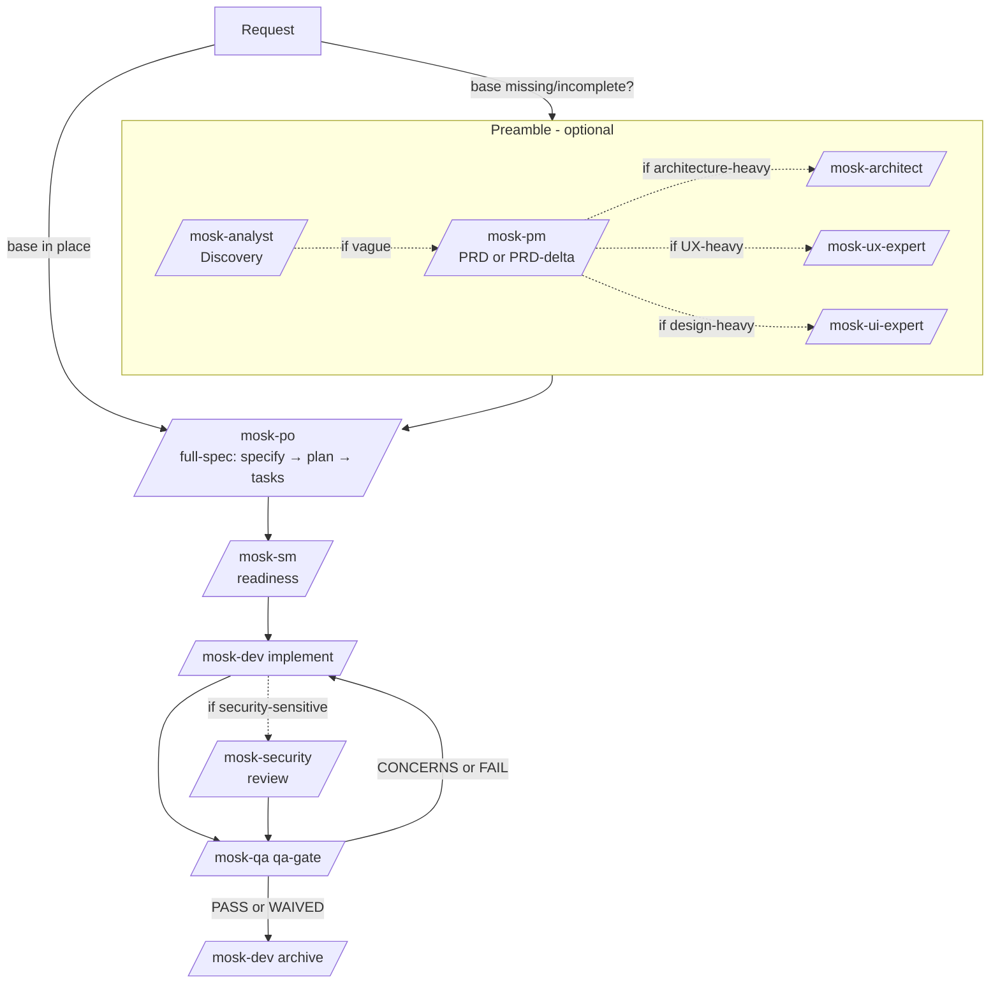

# MOSK

Spec-driven development toolkit for Claude Code. Nine specialist agents, one pipeline, two mirrored layers of documentation — installable into any repository through `.claude/`.

> **Novo — MOSK Bench:** um modo que deixa pessoas **não técnicas** criarem e
> testarem suas próprias ferramentas internas só descrevendo o que precisam, em
> português e sem nenhuma decisão técnica. **[Leia o guia do Bench](./BENCH.md)**

## Why MOSK

Every meaningful change in a real codebase deserves an explicit trail: a brief that framed it, a spec that scoped it, a plan that solved it, tasks that delivered it, a gate that validated it, and an archive that preserves it. MOSK turns that trail into a lightweight, convention-driven workflow with low token overhead and no mandatory menus.

- **Role clarity** — each agent owns one thing well and knows when to defer.
- **Structured artifacts** — specs, plans, tasks, stories, gates, ADRs all live in predictable places.
- **Explicit handoffs** — pipeline agents detect when a preamble agent is needed and suggest it; they never invoke another agent autonomously.
- **Incremental delivery** — every spec carries metadata, progresses through phases, and is archived with promotable artifacts.

## Installation

```bash
npx degit rogerznts/mosk/mosk .
```

Force-overwrite an existing install:

```bash
npx degit rogerznts/mosk/mosk . --force
```

First-time setup for a codebase:

```bash
/mosk-boot
```

`mosk-boot` reads the project, generates `.claude/rules/` (a compact `project.md` plus `frontend.md` when frontend code is detected), and scaffolds the canonical `docs/` layout. Re-run it whenever the project structure changes significantly.

For Codex users, create symlinks after install:

```bash
bash .claude/mosk/scripts/link-codex-skills.sh
```

Restart Claude Code after install so the new skills load.

## Agents

| Skill | Responsibility |
|---|---|
| `/mosk-analyst` (Maria) | discovery, research, brainstorming |
| `/mosk-pm` (João) | PRD, product scope, PRD delta |
| `/mosk-architect` (Vinicius) | architecture, APIs, integrations, ADRs |
| `/mosk-ux-expert` (Salete) | user flows, wireframes, front-end specs |
| `/mosk-ui-expert` (Tiago) | premium UI, design system — plus the **Hallmark** anti-slop flow |
| `/mosk-po` (Sara) | specs, planning, task generation |
| `/mosk-sm` (Roberto) | story readiness, sequencing |
| `/mosk-dev` (Jaime) | implementation, QA fixes, archive |
| `/mosk-qa` (Joaquim) | quality gates, test strategy, reviews |
| `/mosk-security` (Heitor) | diff-aware vulnerability review, findings triage |
| `/mosk-bench` (Bento) | workbench mode for non-technical users (Payload stack) |
| `/mosk-orq` (Mauro) | **autonomous delivery run** — parallel agents, opt-in per run |

Each agent ships as **two layers**: `.claude/agents/mosk-<name>.md` is the
definition — and what makes it invocable by another agent in an isolated context
— while `.claude/skills/mosk-<name>/SKILL.md` is a generated wrapper that gives
you the `/mosk-<name>` slash command. Edit the agent; the wrapper is regenerated.

An agent may invoke another **to execute** work whose route a human already
approved — never to decide where the pipeline goes.

> **[docs/agents.md](./docs/agents.md)** — roster, the two layers, the invocation
> protocol, and what is particular to `bench`, `deploy`, `security` and Hallmark.
> **[TASKS.md](TASKS.md)** — every task each agent can run, with examples.

Natural language is the preferred UX: slash-activate the agent and describe what
you want; you can also name the task directly.

## Flow

A single pipeline. An optional **preamble** runs first whenever the base of the project (or the feature) is not yet grounded.

The pipeline is **consultative end to end**: every phase change, every gate
verdict and every detour is the human's call. Agents suggest and wait; they
never route on their own.



Defaults:

- **Skip the preamble** when the project base (PRD, architecture, UI) already supports the request; go straight to `/mosk-po full-spec`.
- **Use the preamble** when the base is missing or stale. Only call the agents that materially help this change. Outputs may be written at the **base** (`docs/<domain>/`) when canonical, or **per-spec** (`docs/specs/{id}/<domain>/`) when specific to this change.
- **Compact path:** `full-spec → implement → qa-gate → archive`.
- **Granular path:** `specify → plan → tasks → implement → qa-gate → archive`.
- **Optional helpers:** `clarify`, `analyze`, `checklist`.

`full-spec` stops at `tasks`. Implementation stays with `/mosk-dev`.

### The correction cycle

When the gate returns `CONCERNS`/`FAIL`, the work goes back to `/mosk-dev apply-qa-fixes` and then to the gate again. **You decide each turn** — the cycle never iterates on its own.

- **Termination** is the single gate verdict `PASS`/`WAIVED`. Task checkboxes feed the gate; they are not a parallel exit.
- **`quality_score`** is *computed* (`100 − 20×FAIL − 10×CONCERNS`), never estimated, and accumulated in `score_history` inside `gate.yaml`. The gate presents the series — `61 → 68 → 69` — alongside the verdict.
- That series is what makes the decision informed: a **flat** score across turns says another round will not help, and the honest move is to escalate to whoever owns the design or the story. A **rising** score says the opposite.

It is distinct from the bench's automated `loop-until-green`: this cycle serves a **technical operator** and pauses for questions; the bench serves a layperson and never does.

## Document Organization

MOSK uses two mirrored layers: the **base** (project-wide truth) and **per-spec** (scope of a single feature/fix).

Top-level shape:

```
docs/
├── index.md          # auto-generated entry point (task: index-docs)
├── discovery/        # mosk-analyst
├── prd/              # mosk-pm (sharded)
├── architecture/     # mosk-architect (+ adr/)
├── ui/               # mosk-ux-expert + mosk-ui-expert
├── qa/gates/         # mosk-qa
├── project/          # mosk-pm planner (non-technical plan + dated updates)
└── specs/            # per-spec folders + archive/
```

The full canonical tree (including the per-spec internals like `spec-meta.yaml`, `stories/`, `tests/`, `gate.yaml`) is documented in [`mosk/.claude/mosk/templates/project-rule-tmpl.md`](mosk/.claude/mosk/templates/project-rule-tmpl.md), the file `/mosk-boot` uses to generate `.claude/rules/project.md` in every consuming project.

**Base vs spec decision rule**

- Artifact describes the project as it **is today** → `docs/<domain>/`.
- Artifact is **specific to a pending change** → `docs/specs/{id}/<domain>/`.
- Artifact born in a spec but destined to become canonical → starts in the spec and is **promoted** at archive time.

### Promotion Convention

Artifacts inside `specs/{id}/` that should become canonical carry a `promote:` front-matter declaring destination and mode:

```yaml
---
promote: docs/architecture/adr/adr-0007-coupon-service.md
promote_mode: copy
---
```

| `promote_mode` | Behavior at archive |
|---|---|
| `copy` | Copy the file to the target path. Asks before overwrite. |
| `append` | Append the body (minus front-matter) to the target. |
| `manual` | Don't apply automatically. Print the file + suggested destination and ask the user to apply by hand. Default for `prd-delta.md`. |

Without `promote:`, the artifact freezes inside the archived spec.

### Transforming raw drafts with `shard-doc`

When `mosk-pm` writes a monolithic PRD to `docs/prd/raw.md` (or the architect writes `docs/architecture/raw.md`), the optional `shard-doc` task splits it into `index.md` + section files **in the same folder**. Run it when you want a navigable sharded view.

### Project tracking with `planner`

`/mosk-pm planner` maintains a **non-technical** tracking plan plus a dated update log aimed at PO, stakeholders, and project managers — progress, scope, and value, not implementation detail. A technical file may be cited, but that is never the focus. The scope follows the current branch:

- **Base branch** (`main`/`master`/`develop`/`dev`) → the whole project, in `docs/project/plan.md` + `docs/project/update-YYYYMMDD.md`.
- **Spec branch** → that spec, in `docs/specs/{id}/project/plan.md` + `update-YYYYMMDD.md`, **plus** a light refresh of the project plan so the spec shows up as one line of the whole.

Cadence, status vocabulary, and tone live in `docs/discovery/project-manual.md` (seeded on first run). The planner reads it, the living docs (project first, then the current spec), and recent git activity — translating commits into business-readable progress. It always emits a dated update suitable for a tracking PR, even when nothing changed.

## Spec Numbering and Concurrency

Spec numbers are globally unique, three-digit, zero-padded (`001`, `002`, …). When multiple developers create specs in parallel, `create-new-feature.sh` pushes atomically and retries with a new number if the push is rejected — up to 3 attempts before surfacing a clear error.

Each spec carries `spec-meta.yaml`:

```yaml
spec_number: "005"
spec_id: "005-feature-checkout-coupon"
type: feature
branch: "feature/005-checkout-coupon"   # branch != pasta (ADR-0017)
created_at: "2026-04-22T14:30:00Z"
created_by: "Alice <alice@example.com>"
status: active             # active | archived
current_phase: specify     # specify | plan | tasks | implement | qa-gate | archived
last_phase_change: "2026-04-22T14:30:00Z"
```

Pipeline tasks (`plan`, `tasks`, `implement`, `qa-gate`, `archive`) update `current_phase` as they run. `index-docs` reads these files to build the Active Specs table in `docs/index.md`.

## Entry Point: `docs/index.md`

`docs/index.md` is the canonical first read for new contributors. It is auto-generated by the `index-docs` task and refreshed at every pipeline step:

- **Overview** — links to the 6 base domains (discovery, prd, architecture, ui, qa, project).
- **Active Specs** — table sourced from each `docs/specs/*/spec-meta.yaml`, newest first.
- **Archived Specs** — list from `docs/specs/archive/*`, most recently archived first.
- **Domain Contents** — alphabetical file listing per base folder, with titles and short descriptions.

Manual regeneration: `/mosk-dev index-docs`.

Preserve custom text between `<!-- custom -->` and `<!-- /custom -->` markers — regenerations leave them untouched.

## Escalation Policy

Pipeline agents (`po`, `sm`, `dev`, `qa`) detect signals they have no authority to resolve mid-flight — a missing ADR, an unspecified flow, a PRD conflict — and pause with a standard block:

> **Preciso de outro agente antes de seguir**
> - O que apareceu: *o que foi detectado*
> - Quem resolve: `/mosk-architect`
> - Prompt pronto: `/mosk-architect decidir o contrato do serviço de cupom`
> - Onde o resultado fica: `docs/specs/005-feature-checkout-coupon/architecture/`
> - Quando voltar: retomo o `implement` de onde parei.

Agents never invoke each other automatically. The user answers `pode ir`, `pula`, or something else. The agent that is called writes inside the active spec and ends by pointing back to whoever was interrupted.

**The block is written for the reader.** It is emitted in the project's communication language, in ordinary words, with a prompt that can be pasted as-is. `escalation`, `side-trip`, `guard`, `preamble` are the toolkit's internal vocabulary and never appear in output — the same rule that governs identifiers (see the output contract in `.claude/rules/project.md`).

**What an agent may delegate.** Agents coordinate through the runtime's own
subagents, under one rule: **execution delegates, routing does not.** A `dev` may
hand `[P]` units to other `dev` subagents, or ask `qa` to verify a result in a
clean context; a `qa` may ask `security` for a report. None of them may change a
phase, rule on a gate, or call a preamble agent — those are routing, and routing
is yours. Every delegation is declared before and reported after, and never nests
more than one level deep. See [ADR-0012](./docs/architecture/adr/adr-0012-route-decision-vs-phase-execution.md)
and [ADR-0016](./docs/architecture/adr/adr-0016-agent-invocation-protocol.md).

**Parallel work inside a phase.** When `tasks.md` marks two or more units `[P]`,
`implement` may run them as separate `mosk-dev` subagents. `[P]` means *different
files, no dependencies* — it is **honoured as written, never inferred**. Where it
is absent, work runs sequentially: the cost is asymmetric, since a wrongly
parallel pair writing the same file corrupts work that would have succeeded
serially.

### Running a spec unattended — `/mosk-orq`

Everything above pauses and waits for you. `/mosk-orq` is the one place that does
not: it takes a spec that already has `spec.md`, `plan.md` and `tasks.md`, opens
one `mosk-dev` **per user story in its own git worktree**, merges, has `mosk-qa`
and `mosk-security` verify the result, and repeats until the gate passes.

```bash
/mosk-orq 012          # entrega a spec 012 sozinho
```

- **Opt-in per run.** No configuration value turns this on. You consent each time,
  after a preflight that states what it will do alone and what will stop it —
  including how strong the verification is (no test suite = the gate's judgment
  only, and it says so).
- **It stops on doubt and on anything irreversible**: ambiguous acceptance
  criteria, a decision the plan does not cover, a business-rule gap, a merge
  conflict, the attempt cap, a flat score — and always before a migration, a
  deploy, a push, or waiving a gate.
- **Every autonomous decision is logged** to `docs/specs/{id}/run-log.md`,
  versioned. You did not watch it happen, so it has to be readable afterwards.
- **`archive` stays yours.** It promotes artifacts and closes the spec.

See [ADR-0019](./docs/architecture/adr/adr-0019-autonomous-delivery-runner.md).
It is the second scoped exception to the consultative rule — the first being the
bench's `loop-until-green` (ADR-0002) — and it rests on a different ground:
**consent**, not audience. That difference is why this runner, unlike the bench,
may never call a preamble agent on its own.

> MOSK once shipped a *different* `/mosk-orq`: a multi-terminal orchestrator over
> an external actuator, removed once both runtimes gained native subagents
> ([ADR-0018](./docs/architecture/adr/adr-0018-remove-orchestration-layer.md)).
> This one is not that one — it does what that one could not.

## Spec Types

Specs share a single pipeline; the type appears in both the branch and the
folder — but **in different positions, on purpose** (ADR-0017):

```
branch:  {type}/{###}-{short-name}     e.g.  feature/012-checkout-coupon
folder:  docs/specs/{###}-{type}-{short-name}
                                       e.g.  docs/specs/012-feature-checkout-coupon
```

The folder stays flat so that `docs/specs/` never grows a directory level per
type. The bridge between the two strings is the `branch` field in
`spec-meta.yaml` — never string equality. The old branch shape
(`012-feature-checkout-coupon`) is still resolved, but is not what
`create-new-feature.sh` creates.

Supported types:

- `feature`
- `fix`
- `hotfix`
- `gmud`
- `refactor`
- `experimental`


## Migrating Existing Projects

Projects carrying older layouts (`docs/prd.md`, `docs/architecture.md`, `docs/stories/`) are migrated in place with a single idempotent script:

```bash
bash .claude/mosk/scripts/migrate-docs-structure.sh --dry-run   # preview
bash .claude/mosk/scripts/migrate-docs-structure.sh              # apply
```

The migration:

- scaffolds the canonical `docs/` layout,
- moves monoliths to `docs/<domain>/raw.md` (ready for `shard-doc`),
- maps stories into `docs/specs/{id}/stories/` by epic-number heuristic (unmatched go to `_orphan-stories/` for manual review),
- creates retroactive `spec-meta.yaml` for each existing spec folder,
- rewrites `.claude/mosk/core-config.yaml` to the current schema (with a `.legacy` backup),
- seeds `docs/index.md`.

Flags: `--dry-run` (preview), `--keep-old` (copy instead of move), `--help`.

After the script runs, residual files often remain — briefs at `docs/` root, a legacy `docs/epics/` folder, orphan stories without an epic match. Load the companion prompt `.claude/mosk/utils/post-migration-organize.md` in a Claude Code session to walk those resíduos into the canonical layout: it scans `docs/`, classifies each file by domain heuristics, allocates orphan stories/epics into existing or newly-created specs, and regenerates `docs/index.md` at the end. Nothing is moved without your confirmation.

Projects with legacy `ctx-*` context skills can convert them to plain rules:

```bash
bash .claude/mosk/scripts/migrate-ctx-skills-to-rules.sh
```

## Installed Structure

```text
your-project/
├── .claude/
│   ├── agents/           # the 11 agent definitions (source of truth)
│   ├── mosk/
│   │   ├── tasks/
│   │   ├── templates/
│   │   ├── checklists/
│   │   ├── data/           # reference material read by tasks
│   │   │   └── hallmark/   # vendored Hallmark (MIT) — see VENDOR.md
│   │   ├── scripts/
│   │   └── core-config.yaml
│   ├── rules/            # generated by /mosk-boot — never touched by updates
│   └── skills/           # generated wrappers: /mosk-<name>
│       ├── mosk-analyst/    mosk-architect/   mosk-bench/
│       ├── mosk-boot/       mosk-deploy/      mosk-dev/
│       ├── mosk-handoff/    mosk-help/        mosk-pm/
│       ├── mosk-po/         mosk-qa/          mosk-security/
│       ├── mosk-sm/         mosk-suggestion/  mosk-ui-expert/
│       ├── mosk-update/     mosk-ux-expert/   mosk-write-skill/
│       └── tea-*/           # git/Gitea helpers
└── docs/
    ├── index.md
    ├── discovery/
    ├── prd/
    ├── architecture/
    │   └── adr/
    ├── ui/
    │   └── flows/
    ├── qa/
    │   └── gates/
    └── specs/
        └── archive/
```

## Maintenance Scripts

Under `.claude/mosk/scripts/`:

- `create-new-feature.sh` — spawns a new spec folder + branch + `spec-meta.yaml`, with push-atomic retry for concurrent usage. Accepts `--type`, `--short-name`, `--number`, `--no-push`, `--json`.
- `sync-agents-skills.sh` — regenerates skill wrappers from agent definitions and vice-versa. Use `--clean` to prune orphans, `--dry-run` to preview. Existing wrappers are edited in place — only the `description:` line is refreshed, so extra front-matter keys and hand-written bodies survive. A skill's description is declared by the agent itself, on its first line (`<!-- skill-description: … -->`), deliberately separate from `## Mission`: one is routing metadata, the other is persona prose.
- `sync-hallmark.sh` — updates the vendored Hallmark fork. Diffs the pinned upstream against the local copy to recover the MOSK adaptations, then replays them onto the new ref; a conflict leaves `.rej` files and **does not touch the vendor**. Accepts `--ref`, `--dry-run`.
- `link-codex-skills.sh` — refreshes `.codex/skills/`, `.codex/rules/`, and `AGENTS.md` for Codex users.
- `migrate-docs-structure.sh` — migrates a legacy `docs/` layout to the current one (idempotent).
- `migrate-ctx-skills-to-rules.sh` — converts legacy `ctx-*` context skills to `.claude/rules/*.md`.
- `audit-docs-paths.sh` — verifies that tasks, templates, and `core-config.yaml` declare outputs only under canonical `docs/` domains and that referenced config keys and template files exist. Five rules (R1–R5), exit 0 on `clean ✓` and exit 1 with a `path:line :: rule :: detail` list on violations. Modes: default and `--quiet`. Also reachable via `/mosk-dev audit`.
- `reset-install.sh` — reinstalls the toolkit from scratch: deletes the previous install (including files that no longer exist upstream) before copying the new one. Used by `/mosk-update`, because `degit --force` overwrites but **never deletes**. Preserves `.claude/rules/`, settings, `docs/` and your own skills. Accepts `--from`, `--to`, `--dry-run`, `--json`.
- `check-ship-ready.sh` — single source of "this spec is closed": phase archived, `promote:` artifacts applied, clean working tree. Accepts `--json`.
- `selftest-common.sh` — the repo's automated check: spec numbering rules and `common.sh` path resolution in **bash and zsh**. Both have broken in production before.
- `check-prerequisites.sh`, `setup-plan.sh`, `update-agent-context.sh`, `common.sh` — helpers used by tasks.

## Optional Environment Tools

MOSK runs inside Claude Code. For extra operational isolation, these pair well with it:

- `workz` — isolated worktrees
- `ai-jail` — filesystem confinement

## Inspiration

MOSK owes a real conceptual debt to:

- **BMAD** — role-driven collaboration with specialist agents.
- **SpecKit** — turning vague requests into explicit, ordered artifacts.

The product is MOSK-first: a lighter, synthesized toolkit built to disappear into real projects instead of standing apart from them.
