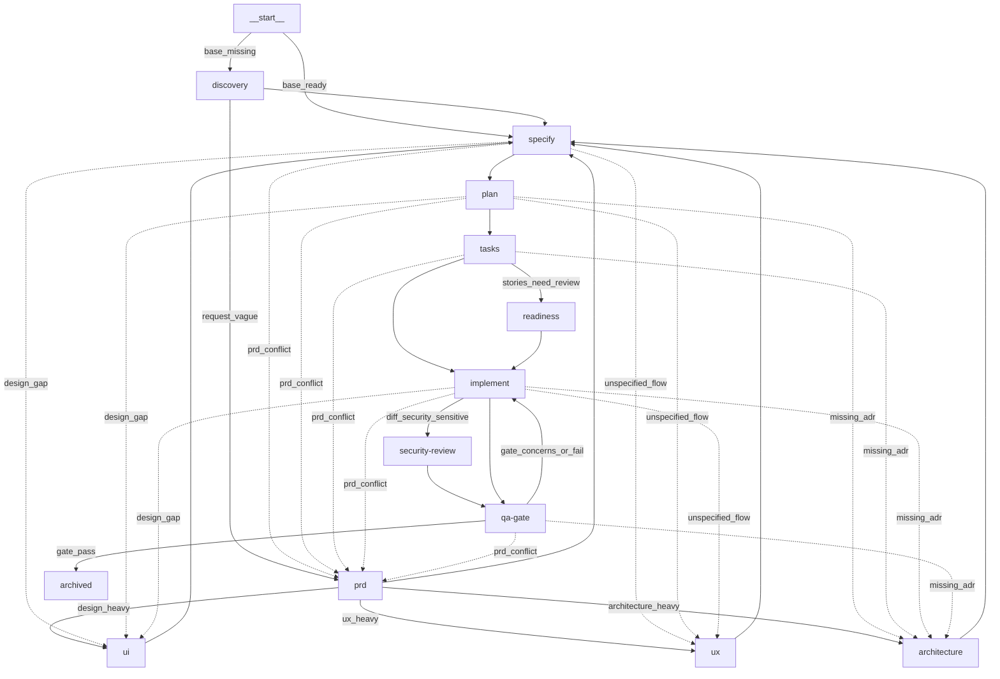

# MOSK — Índice da Documentação

> Entry point gerado/atualizado pelo fluxo `planner` (mosk-pm). Ponto de
> partida para navegar a documentação viva do projeto.

Last updated: 2026-07-22

## Fluxo do Pipeline

<!-- graph:begin -->

<!-- graph:end -->

## Visão geral

MOSK é a toolkit própria de **Spec-Driven Development (SDD)** que padroniza a
evolução do ERP v3 da Ballroom. Acompanhamento de projeto espelhado no Plane em
**CORPO-776 — "P2.4 - MOSK Toolkit SDD"** (workspace `ballroom`, projeto
Corporativo).

## Domínios base

- **discovery/** — `project-manual.md` (manual de acompanhamento PMO: Tripé,
  Protocolo Nexus, Pulsação, auditoria de metadados);
  [`mosk-payload-mode-brief.md`](./discovery/mosk-payload-mode-brief.md)
  (brief do modo `/mosk-bench`, persona Bento — 13 decisões).
- **architecture/** — [`mosk-payload-mode.md`](./architecture/mosk-payload-mode.md)
  (design do modo `/mosk-bench`) + [`adr/`](./architecture/adr/)
  (ADR-0001 infra compartilhada, ADR-0002 auto-escalação escopada,
  ADR-0003 golden starter versionado, ADR-0004 orquestração agnóstica de
  runtime — promovido no archive da spec 002; ADR-0005 deploy escopado;
  ADR-0006 grafo de orquestração consultivo — spec 004;
  ADR-0008 delivery-loop consultivo — promovido no archive da spec 005) +
  [`glossary.md`](./architecture/glossary.md) (termos de domínio; promovido da spec 005).
- **project/** — planejamento vivo do projeto:
  - [`plan.md`](./project/plan.md) — plano de projeto (6 épicos).
  - [`guia-atualizacao-plane.md`](./project/guia-atualizacao-plane.md) — como
    espelhar o planejamento no Plane (CORPO-776).
  - [`update-20260531.md`](./project/update-20260531.md) — último update datado.
  - [`epics/`](./project/epics/) — um arquivo por épico (Tripé + evidência).

## Planejamento (épicos ↔ Plane)

| # | Épico | Plane | Estado |
|---|---|---|---|
| 01 | Fundação do toolkit & distribuição (degit) | CORPO-1254 | Done |
| 02 | Agentes, skills & menus (rebrand MOSK) | CORPO-1255 | Done |
| 03 | Pipeline SpecKit, papéis & bootstrap de contexto | CORPO-1256 | Done |
| 04 | Integrações: Codex, taste system & rastreabilidade E2E | CORPO-1257 | Done |
| 05 | Estrutura docs v2, sync agente-skill, rules & auditoria | CORPO-1258 | Done |
| 06 | Framework modular, planejamento, handoff & manutenção | CORPO-1259 | Done |

## Specs

### Ativas

| # | Spec | Fase | Branch | Criada |
|---|---|---|---|---|
| 004 | [feature-orchestration-graph](./specs/004-feature-orchestration-graph/) (grafo de orquestração consultivo) | implement | 004-feature-orchestration-graph | 2026-07-22 |

### Arquivadas

| # | Spec | Fase | Branch | Arquivada |
|---|---|---|---|---|
| 005 | [feature-delivery-loop](./specs/archive/005-feature-delivery-loop/) (delivery-loop consultivo e limitado) | archived | 005-feature-delivery-loop | 2026-07-22 |
| 002 | [feature-mosk-payload-mode](./specs/archive/002-feature-mosk-payload-mode/) (modo `/mosk-bench`) | archived | 002-feature-mosk-payload-mode | 2026-07-20 |

### Outras

- `specs/001-refactor-structure-v2/` — `plan.md` (sem `spec-meta.yaml`; não
  ativo no rastreamento de fase).

## Updates recentes

- [2026-05-31](./project/update-20260531.md) — reconstrução do planejamento a
  partir do histórico Git e espelhamento no Plane (CORPO-776).
